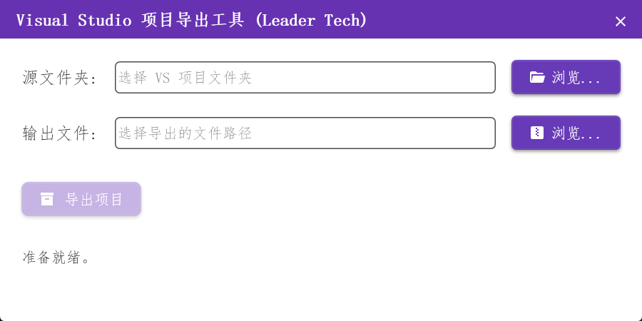

# CopyVSProject

`CopyVSProject` 是一款功能强大且直观的桌面应用程序，旨在简化复制 Visual Studio 项目的过程。它通过智能地排除不必要的文件和文件夹（例如构建产物、临时文件和版本控制元数据）来帮助开发人员创建干净、可移植的项目副本。

此工具非常适合备份项目、与同事共享项目或准备部署，而无需包含大型、不相关的文件。

## 主界面

以下是应用程序主窗口的屏幕截图，展示了其用户友好的界面。



## 功能

*   **智能复制：** 自动识别并排除常见的 Visual Studio 构建输出 (`bin`、`obj`)、`.vs` 文件夹、`packages` 目录和其他临时文件。
*   **可自定义排除项：** 允许用户定义额外的自定义排除模式，以根据其特定需求调整复制过程。
*   **源和目标选择：** 轻松选择源项目目录和目标目标路径。
*   **进度跟踪：** 提供复制过程的实时反馈。
*   **干净的项目副本：** 确保只复制必要的项目文件，从而生成更小、更易于管理的存档。

## 安装

### 从发布版本

最简单的入门方法是从 [发布页面](https://github.com/your-username/CopyVSProject/releases) 下载最新的稳定版本（如果可用，请替换为实际链接）。下载 `.zip` 文件，解压其内容，然后运行 `CopyVSProject.exe`。

### 从源代码构建

如果您更喜欢自己构建应用程序，请按照以下步骤操作：

1.  **先决条件：**
    *   .NET SDK 6.0 或更高版本
    *   Visual Studio 2022 或更高版本（推荐）

2.  **克隆存储库：**
    ```bash
    git clone https://github.com/your-username/CopyVSProject.git
    cd CopyVSProject
    ```

3.  **构建项目：**
    在 Visual Studio 中打开 `CopyVSProject.sln` 解决方案文件并构建解决方案，或使用 .NET CLI：
    ```bash
    dotnet build CopyVSProject.sln --configuration Release
    ```

4.  **运行应用程序：**
    可执行文件将位于 `CopyVSProject/bin/Release/net6.0-windows/`（如果您在 Debug 配置中构建，则为 `Debug`）。

## 使用指南

1.  **启动应用程序：** 运行 `CopyVSProject.exe`。

2.  **选择源文件夹：** 单击“源项目路径”字段旁边的“浏览”按钮，然后选择 Visual Studio 项目的根目录（包含 `.sln` 文件或 `.csproj` 文件的文件夹）。

3.  **选择目标文件夹：** 单击“目标路径”字段旁边的“浏览”按钮，然后选择要保存项目干净副本的位置。

4.  **查看排除项（可选）：** 应用程序带有一组默认的排除规则。如果您需要添加或修改这些规则，请在应用程序中查找设置或配置部分（这部分是假设，如果应用程序没有此功能，则应删除此行）。

5.  **开始复制：** 单击“复制项目”或类似按钮以启动复制过程。进度指示器将显示状态。

6.  **完成：** 过程完成后，您将在指定的目标文件夹中找到 Visual Studio 项目的干净副本。

## 贡献

欢迎贡献！如果您有改进建议、错误报告或想贡献代码，请随时在 GitHub 存储库上提出问题或提交拉取请求。

## 许可证

本项目根据 MIT 许可证获得许可 - 有关详细信息，请参阅 [LICENSE](LICENSE) 文件（如果不存在，请创建 LICENSE 文件）。